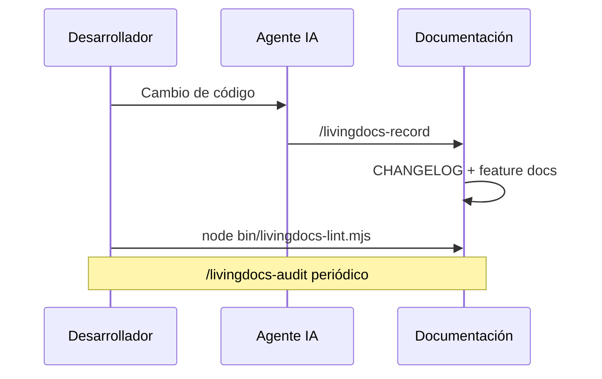

# livingdocs

[](https://github.com/JoaquinJ2/livingdocs)
[](LICENSE)

Plugin para **Cursor** y **Claude Code** que mantiene la documentación alineada con el código: visión, roadmap, catálogo de features, docs por capacidad y changelog.

La premisa es simple: un cambio de comportamiento no está terminado hasta que los documentos que lo describen digan lo nuevo. La documentación describe **lo que es verdad hoy**; la intención vive en el roadmap.

## Para quién

Equipos que trabajan con agentes de IA (Cursor o Claude Code) y quieren que la documentación no se pudra en silencio. livingdocs aporta:

- Un **contrato de formato** (`DDD.md`) que el linter y los skills respetan.
- Skills de agente (`/livingdocs-*`) para instalar, inventariar, registrar cambios y auditar drift.
- Un **linter estructural** (`bin/livingdocs-lint.mjs`) y un **stop hook** de Cursor que recuerda documentar antes de dar por cerrado un cambio.

## Requisitos

- [Node.js](https://nodejs.org/) 18 o superior (solo built-ins; sin dependencias npm)
- [Git](https://git-scm.com/)
- [Cursor](https://cursor.com/) o [Claude Code](https://docs.anthropic.com/en/docs/claude-code), según cómo instales el plugin

## Instalación del plugin

### Vía A — Plugin (recomendada)

1. Instala el plugin desde GitHub:
   - **Cursor:** Settings → Plugins → Add from GitHub → `JoaquinJ2/livingdocs`
   - **Claude Code:** instala el plugin apuntando a este repositorio (el manifiesto está en `.claude-plugin/plugin.json`)
2. Abre el proyecto destino en el IDE.
3. En el chat del agente, ejecuta:

```text
/livingdocs-install
```

4. Continúa con la visión y el inventario (ver [Uso en un proyecto](#uso-en-un-proyecto)).

### Vía B — Manual (sin plugin)

Clona o descarga este repositorio y copia los archivos al proyecto destino. Rellena los placeholders de las plantillas (`{{...}}`) con los datos del proyecto.

| Origen en livingdocs | Destino en el proyecto |
| --- | --- |
| [`templates/DDD.md`](templates/DDD.md) | `DDD.md` (rellenar placeholders) |
| [`templates/CHANGELOG.md`](templates/CHANGELOG.md) | `CHANGELOG.md` |
| [`templates/FEATURES.md`](templates/FEATURES.md) | `FEATURES.md` |
| — | `features/.gitkeep` |
| — | `.livingdocs.json` (ver [Configuración](#configuración)) |
| [`assets/livingdocs-lint.mjs`](assets/livingdocs-lint.mjs) | `bin/livingdocs-lint.mjs` |
| [`assets/hooks/livingdocs-stop.sh`](assets/hooks/livingdocs-stop.sh) | `.cursor/hooks/livingdocs-stop.sh` (`chmod +x`) |
| [`assets/hooks.json`](assets/hooks.json) | fusionar en `.cursor/hooks.json` (no sobrescribir) |
| — | sección `## Living documentation` en `AGENTS.md` y/o `CLAUDE.md` |

Copia los scripts **tal cual**, sin editarlos: leen `.livingdocs.json` para las rutas del repo. Si `.cursor/hooks.json` ya existe, conserva su `version` y añade la entrada de livingdocs al array `stop` solo si aún no está.

Añade (o sustituye el cuerpo de) esta sección en `AGENTS.md` / `CLAUDE.md`:

```markdown
## Living documentation

Documentation is part of the change, not a follow-up. Before calling any behaviour change done, run `/livingdocs-record` — it reads the real diff and updates `CHANGELOG.md`, the affected `features/<slug>/<slug>.md` docs, and `FEATURES.md`.

The format contract and the full workflow are in `DDD.md`. Validate with `node bin/livingdocs-lint.mjs`.

Feature docs describe capabilities. They are not a replacement for the glossary or for ADRs, which keep their existing homes.
```

Sin el plugin, los comandos `/livingdocs-*` no estarán disponibles como skills; puedes usar el linter y las plantillas a mano, o instalar el plugin después.

## Uso en un proyecto

Flujo típico tras instalar:

```text
/livingdocs-install      → scaffold (DDD, CHANGELOG, FEATURES, lint, hook)
/livingdocs-vision       → VISION.md + ROADMAP.md
/livingdocs-inventory    → FEATURES.md + features/<slug>/<slug>.md
```

En el día a día, después de un cambio de comportamiento:

```text
/livingdocs-record       → actualiza CHANGELOG + feature docs afectados
node bin/livingdocs-lint.mjs
```

De vez en cuando, para detectar drift:

```text
/livingdocs-audit        → informe de solo lectura
/livingdocs-backfill     → aplica solo los hallazgos que apruebes
```



Un install fresco deja `VISION.md` y `ROADMAP.md` sin crear a propósito: el lint los marcará como ausentes hasta que ejecutes `/livingdocs-vision`. Eso es el estado esperado, no un fallo.

## Estructura de la documentación

| Documento | Responde | Cambia cuando |
| --- | --- | --- |
| `VISION.md` | ¿Hacia dónde va esto y en qué fase estamos? | Cambia la dirección |
| `ROADMAP.md` | ¿Cuáles son los próximos outcomes y en qué orden? | Cambian las prioridades |
| `FEATURES.md` | ¿Qué puede hacer el producto hoy? | Aparece, cambia de estado o muere una capacidad |
| `features/<slug>/<slug>.md` | ¿Cómo se comporta una capacidad? | Cambia el comportamiento de esa capacidad |
| `CHANGELOG.md` | ¿Qué cambió, cuándo y por qué? | Cada cambio de comportamiento |
| `DDD.md` | ¿Cómo mantenemos todo lo anterior verdadero? | Cambia el proceso |

Una **feature** es una capacidad visible para el usuario, enunciada como un outcome de una frase. Los módulos internos se documentan dentro de la feature que los posee, nunca como feature propia.

Cada feature doc exige exactamente ocho H2, en este orden: Why it exists, Behaviour, Boundaries, Key files, Data, Gates and failure modes, Known gaps, Related. El estado solo admite `live`, `partial` o `planned`. El contrato completo está en `DDD.md` (tras el install) y en [`templates/feature.md`](templates/feature.md).

## Skills disponibles

| Comando | Qué hace |
| --- | --- |
| `/livingdocs-install` | Scaffold idempotente: docs base, `.livingdocs.json`, lint, stop hook, sección en AGENTS/CLAUDE |
| `/livingdocs-vision` | Escribe o reescribe `VISION.md` y `ROADMAP.md` (opcionalmente desde un documento semilla) |
| `/livingdocs-inventory` | Deriva el catálogo de capacidades del código y propone el slicing antes de escribir |
| `/livingdocs-record` | Tras un cambio: actualiza `CHANGELOG.md` y las feature docs afectadas según el diff |
| `/livingdocs-audit` | Informe de drift solo lectura (código vs docs); no escribe nada |
| `/livingdocs-backfill` | Aplica únicamente los hallazgos del audit que el usuario apruebe |

## Linter

Tras el install, en la raíz del proyecto destino:

```bash
node bin/livingdocs-lint.mjs
node bin/livingdocs-lint.mjs --json
node bin/livingdocs-lint.mjs /ruta/al/repo
```

Salida `0` si está limpio, `1` si hay hallazgos. Comprueba seis cosas:

1. Existen los documentos raíz (`VISION.md`, `DDD.md`, `ROADMAP.md`, `CHANGELOG.md`, `FEATURES.md`, `features/`)
2. Slugs y nombres de archivo en kebab-case
3. Consistencia entre `FEATURES.md` y `features/`
4. Estructura de cada feature doc (ocho H2 y status válido)
5. Los enlaces relativos resuelven a archivos existentes
6. `CHANGELOG.md` no va detrás del último commit de código en las `triggerPaths`

## Hook de Cursor

El install copia [`assets/hooks/livingdocs-stop.sh`](assets/hooks/livingdocs-stop.sh) a `.cursor/hooks/livingdocs-stop.sh` y fusiona la entrada de [`assets/hooks.json`](assets/hooks.json) en `.cursor/hooks.json`.

En el evento `stop`, el hook mira si hubo cambios en rutas de disparo sin actualización correspondiente en la documentación; si es así, recuerda al agente ejecutar `/livingdocs-record`. No bloquea el trabajo: es un recordatorio con `loop_limit: 1`.

## Configuración

`.livingdocs.json` en la raíz del proyecto destino (lo escribe `/livingdocs-install`):

```json
{
  "triggerPaths": ["src/", "app/", "bin/", "prompts/"],
  "satisfyingPaths": ["CHANGELOG.md", "features/"]
}
```

- **`triggerPaths`** — directorios cuyo contenido cambia el comportamiento observable (código, prompts, skills, schemas, config de runtime). El linter y el hook los usan para detectar cambios sin documentar.
- **`satisfyingPaths`** — rutas que “cierran” la deuda de documentación (normalmente changelog y feature docs).

Ajusta las listas a tu repo; no edites el script del linter ni el hook.

## Estructura de este repositorio

```text
livingdocs/
├── .cursor-plugin/plugin.json   # manifiesto Cursor
├── .claude-plugin/plugin.json   # manifiesto Claude Code
├── assets/
│   ├── livingdocs-lint.mjs      # linter estructural
│   ├── hooks.json               # fragmento de hooks a fusionar
│   └── hooks/livingdocs-stop.sh
├── skills/
│   ├── livingdocs-install/
│   ├── livingdocs-vision/
│   ├── livingdocs-inventory/
│   ├── livingdocs-record/
│   ├── livingdocs-audit/
│   └── livingdocs-backfill/
└── templates/
    ├── DDD.md
    ├── VISION.md
    ├── ROADMAP.md
    ├── FEATURES.md
    ├── CHANGELOG.md
    └── feature.md
```

## Licencia

[MIT](LICENSE) © 2026 MotorK
